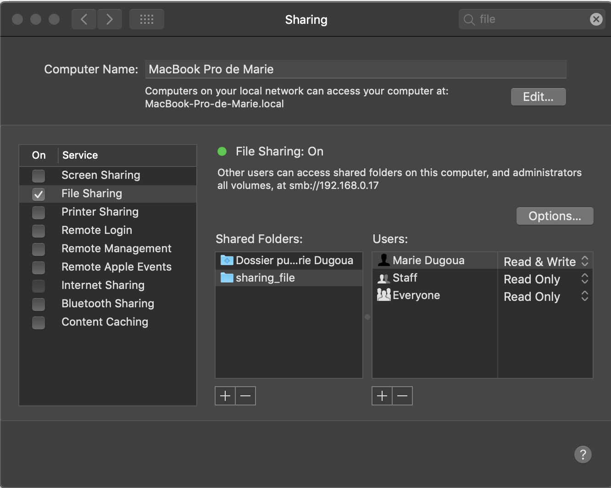
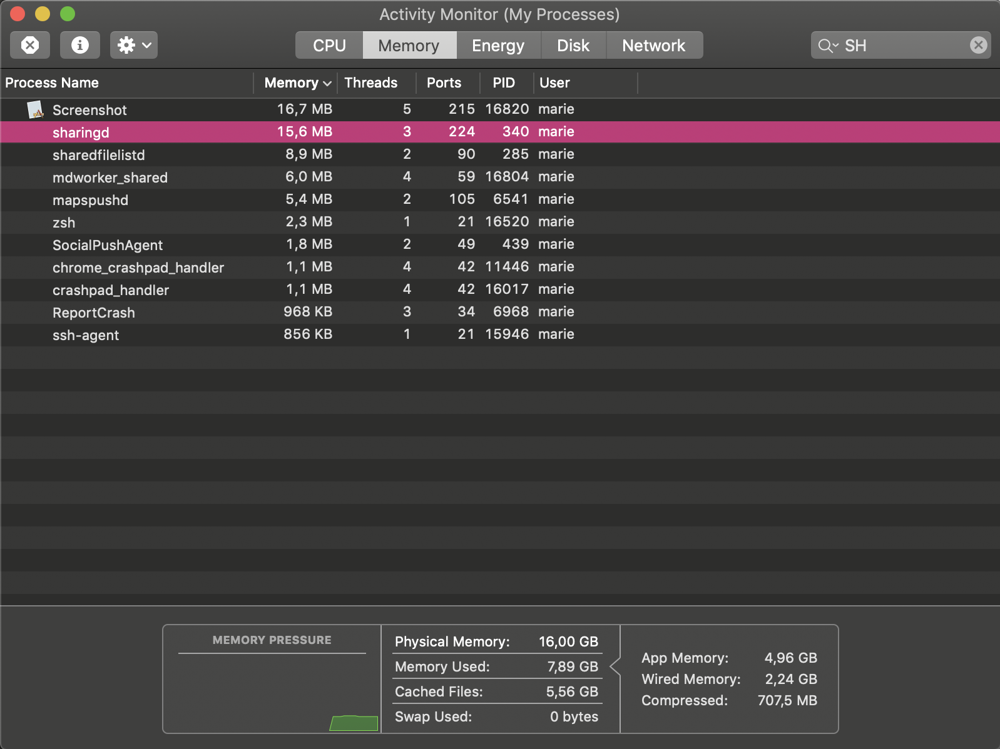

# Maîtrise de poste - Day 1

L'objectif de ce TP est de mieux vous faire appréhender l'OS dans lequel vous évoluer tous les jours.

On va explorer :

- les informations liées à votre OS (liste de périphériques, utilisateurs, etc.)
- l'utilisation des périphériques (partitions de disque, port réseau, etc.)
- la sécurité (sujets autour du chiffrement, la signature, etc.)
- le téléchargement de logiciels (gestionnaire de paquets)
- le contrôle à distance (SSH)
- exposition de service réseau local
- la notion de certificats et de confiance (TLS, chiffrement de mails)

## Self-footprinting

Première étape : prendre connaissance du système. Etapes peut-être triviales mais néanmoins nécessaires.

**Détailler la marche à suivre pour chacune des étapes.**

### Host OS

🌞 Déterminer les principales informations de votre machine

- nom de la machine OS, version, architecture processeur (32-bit, 64-bit, ARM, etc) et modèle du processeur

```powershell
➜  ~ system_profiler SPHardwareDataType
Hardware:

    Hardware Overview:

      Model Name: MacBook Pro
      Model Identifier: MacBookPro15,1
      Processor Name: Intel Core i7
      Processor Speed: 2,2 GHz
      Number of Processors: 1
      Total Number of Cores: 6
      L2 Cache (per Core): 256 KB
      L3 Cache: 9 MB
      Hyper-Threading Technology: Enabled
      Memory: 16 GB
      Boot ROM Version: 1037.100.362.0.0 (iBridge: 17.16.14281.0.0,0)
      Serial Number (system): C02Y4046JGH5
      Hardware UUID: 4489CB17-47D0-50F3-A166-245112804966
```

```powershell
➜  ~ sw_vers
ProductName:	Mac OS X
ProductVersion:	10.14.6
BuildVersion:	18G4032
```

```powershell
➜  ~ uname -a
Darwin MacBook-Pro-de-Marie.local 18.7.0 Darwin Kernel Version 18.7.0: Mon Feb 10 21:08:45 PST 2020; root:xnu-4903.278.28~1/RELEASE_X86_64 x86_64
```

```powershell
➜  ~ hostinfo
Mach kernel version:
	 Darwin Kernel Version 18.7.0: Mon Feb 10 21:08:45 PST 2020; root:xnu-4903.278.28~1/RELEASE_X86_64
Kernel configured for up to 12 processors.
6 processors are physically available.
12 processors are logically available.
Processor type: x86_64h (Intel x86-64h Haswell)
Processors active: 0 1 2 3 4 5 6 7 8 9 10 11
Primary memory available: 16.00 gigabytes
Default processor set: 404 tasks, 1727 threads, 12 processors
Load average: 1.48, Mach factor: 10.51
```

```powershell
➜  ~ getconf LONG_BIT
64
```

```powershell
➜  ~ system_profiler | grep Processor
2020-04-29 10:23:24.857 system_profiler[15126:778294] SystemInfo-AccessoryFW from dict - Tour de contrôle = 0x0114
    Apple: AUDynamicsProcessor:
    IOSlaveProcessor:
      Bundle ID: com.apple.driver.IOSlaveProcessor
      Location: /System/Library/Extensions/IOSlaveProcessor.kext
      Processor Name: Intel Core i7
      Processor Speed: 2,2 GHz
      Number of Processors: 1
[...]
```

```powershell
➜  ~ sysctl -n machdep.cpu.brand_string
Intel(R) Core(TM) i7-8750H CPU @ 2.20GHz
```

- quantité RAM et modèle de la RAM

```powershell
➜  ~ system_profiler SPHardwareDataType | grep "  Memory:"
      Memory: 16 GB
```

### Devices

Travail sur les périphériques branchés à la machine = à la carte mère.

🌞 Trouver

- la marque et le modèle de votre processeur

  ->	identifier le nombre de processeurs, le nombre de coeur

```powershell
➜  ~ system_profiler SPHardwareDataType | grep Processors
      Number of Processors: 1
---------------------------------------------------------
➜  ~ system_profiler SPHardwareDataType | grep Cores
      Total Number of Cores: 6
```

```powershell
➜  ~ system_profiler | grep Processor
2020-04-29 10:23:24.857 system_profiler[15126:778294] SystemInfo-AccessoryFW from dict - Tour de contrôle = 0x0114
    Apple: AUDynamicsProcessor:
    IOSlaveProcessor:
      Bundle ID: com.apple.driver.IOSlaveProcessor
      Location: /System/Library/Extensions/IOSlaveProcessor.kext
      Processor Name: Intel Core i7
      Processor Speed: 2,2 GHz
      Number of Processors: 1
[...]
```

​		*Ma machine a un processeur et 6 coeurs.*

​		->	si c'est un proc Intel, expliquer le nom du processeur (oui le nom veut dire quelque chose)

​		*le nom du processeur est : Intel Core i7, utilisé pour ses microprocesseurs grand plublic haut de gamme. Ces processeurs sont généralement utilisé pour le rendu 3D et autres logiciels.*

- la marque et le modèle :
  
  -> de votre touchpad/trackpad

```powershell
➜  ~ system_profiler -detailLevel basic | grep -A 8 "Keyboard / Trackpad:"
2020-05-07 16:19:35.146 system_profiler[81347:1772143] SystemInfo-AccessoryFW from dict - Tour de contrôle = 0x0114
2020-05-07 16:19:41.482 system_profiler[81382:1772357] SPUSBDevice: IOCreatePlugInInterfaceForService failed 0xe00002be
2020-05-07 16:19:41.482 system_profiler[81382:1772357] SPUSBDevice: IOCreatePlugInInterfaceForService failed 0xe00002be
2020-05-07 16:19:41.483 system_profiler[81382:1772357] SPUSBDevice: IOCreatePlugInInterfaceForService failed 0xe00002be
2020-05-07 16:19:41.484 system_profiler[81382:1772357] SPUSBDevice: IOCreatePlugInInterfaceForService failed 0xe00002be
2020-05-07 16:19:41.485 system_profiler[81382:1772357] SPUSBDevice: IOCreatePlugInInterfaceForService failed 0xe00002be
2020-05-07 16:19:41.485 system_profiler[81382:1772357] SPUSBDevice: IOCreatePlugInInterfaceForService failed 0xe00002be
        Apple Internal Keyboard / Trackpad:

          Product ID: 0x027c
          Vendor ID: 0x05ac (Apple Inc.)
          Version: 9.27
          Serial Number: FM78493051YHYYMAV+WRN
          Speed: Up to 480 Mb/sec
          Manufacturer: Apple Inc.
          Location ID: 0x80500000 / 3
```

​	-> de vos enceintes intégrées

```powershell
➜  ~ system_profiler -detailLevel basic | grep -A 8 "Speakers:"
2020-05-17 18:39:37.986 system_profiler[16608:363737] SystemInfo-AccessoryFW from dict - Tour de contrôle = 0x0114
        MacBook Pro Speakers:

          Default Output Device: Yes
          Default System Output Device: Yes
          Manufacturer: Apple Inc.
          Output Channels: 2
          Current SampleRate: 48000
          Transport: Built-in
          Output Source: MacBook Pro Speakers
```

​	-> de votre disque dur principal

```powershell
➜  ~ diskutil list
/dev/disk0 (internal):
   #:                       TYPE NAME                    SIZE       IDENTIFIER
   0:      GUID_partition_scheme                         500.3 GB   disk0
   1:                        EFI EFI                     314.6 MB   disk0s1
   2:                 Apple_APFS Container disk1         500.0 GB   disk0s2

/dev/disk1 (synthesized):
   #:                       TYPE NAME                    SIZE       IDENTIFIER
   0:      APFS Container Scheme -                      +500.0 GB   disk1
                                 Physical Store disk0s2
   1:                APFS Volume Macintosh HD            319.6 GB   disk1s1
   2:                APFS Volume Preboot                 44.1 MB    disk1s2
   3:                APFS Volume Recovery                510.5 MB   disk1s3
   4:                APFS Volume VM                      1.1 GB     disk1s4
```

🌞 Disque dur

- identifier les différentes partitions de votre/vos disque(s) dur(s)

```powershell
➜  ~ diskutil info disk0
   Device Identifier:         disk0
   Device Node:               /dev/disk0
   Whole:                     Yes
   Part of Whole:             disk0
   Device / Media Name:       APPLE SSD AP0512M

   Volume Name:               Not applicable (no file system)
   Mounted:                   Not applicable (no file system)
   File System:               None

   Content (IOContent):       GUID_partition_scheme
   OS Can Be Installed:       No
   Media Type:                Generic
   Protocol:                  PCI-Express
   SMART Status:              Verified

   Disk Size:                 500.3 GB (500277792768 Bytes) (exactly 977105064 512-Byte-Units)
   Device Block Size:         4096 Bytes

   Read-Only Media:           No
   Read-Only Volume:          Not applicable (no file system)

   Device Location:           Internal
   Removable Media:           Fixed

   Solid State:               Yes
   Hardware AES Support:      Yes
```

```powershell
➜  ~ diskutil info disk1
   Device Identifier:         disk1
   Device Node:               /dev/disk1
   Whole:                     Yes
   Part of Whole:             disk1
   Device / Media Name:       APPLE SSD AP0512M

   Volume Name:               Not applicable (no file system)
   Mounted:                   Not applicable (no file system)
   File System:               None

   Content (IOContent):       EF57347C-0000-11AA-AA11-00306543ECAC
   OS Can Be Installed:       No
   Media Type:                Generic
   Protocol:                  PCI-Express
   SMART Status:              Verified
   Disk / Partition UUID:     4714F1B5-C783-4E6F-8A99-A56AFE96EF56

   Disk Size:                 500.0 GB (499963174912 Bytes) (exactly 976490576 512-Byte-Units)
   Device Block Size:         4096 Bytes

   Read-Only Media:           No
   Read-Only Volume:          Not applicable (no file system)

   Device Location:           Internal
   Removable Media:           Fixed

   Solid State:               Yes
   Virtual:                   Yes
   Hardware AES Support:      Yes
```

- déterminer le système de fichier de chaque partition
- expliquer la fonction de chaque partition

### Network

🌞 Afficher la liste des cartes réseau de votre machine

```powershell
➜  ~ ifconfig
lo0: flags=8049<UP,LOOPBACK,RUNNING,MULTICAST> mtu 16384
	options=1203<RXCSUM,TXCSUM,TXSTATUS,SW_TIMESTAMP>
	inet 127.0.0.1 netmask 0xff000000
	inet6 ::1 prefixlen 128
	inet6 fe80::1%lo0 prefixlen 64 scopeid 0x1
	nd6 options=201<PERFORMNUD,DAD>
gif0: flags=8010<POINTOPOINT,MULTICAST> mtu 1280
stf0: flags=0<> mtu 1280
XHC1: flags=0<> mtu 0
VHC128: flags=0<> mtu 0
XHC0: flags=0<> mtu 0
XHC20: flags=0<> mtu 0
en5: flags=8863<UP,BROADCAST,SMART,RUNNING,SIMPLEX,MULTICAST> mtu 1500
	ether ac:de:48:00:11:22
	inet6 fe80::aede:48ff:fe00:1122%en5 prefixlen 64 scopeid 0x8
	nd6 options=201<PERFORMNUD,DAD>
	media: autoselect (100baseTX <full-duplex>)
	status: active
ap1: flags=8802<BROADCAST,SIMPLEX,MULTICAST> mtu 1500
	ether 3a:f9:d3:2d:f1:80
	media: autoselect
	status: inactive
en0: flags=8863<UP,BROADCAST,SMART,RUNNING,SIMPLEX,MULTICAST> mtu 1500
	ether 38:f9:d3:2d:f1:80
	inet6 fe80::47d:4192:1e60:b16f%en0 prefixlen 64 secured scopeid 0xa
	inet6 2a01:e0a:2:ec80:8f:e496:210e:25d1 prefixlen 64 autoconf secured
	inet6 2a01:e0a:2:ec80:fc91:57de:4ab6:3a48 prefixlen 64 autoconf temporary
	inet 192.168.0.101 netmask 0xffffff00 broadcast 192.168.0.255
	nd6 options=201<PERFORMNUD,DAD>
	media: autoselect
	status: active
p2p0: flags=8843<UP,BROADCAST,RUNNING,SIMPLEX,MULTICAST> mtu 2304
	ether 0a:f9:d3:2d:f1:80
	media: autoselect
	status: inactive
awdl0: flags=8943<UP,BROADCAST,RUNNING,PROMISC,SIMPLEX,MULTICAST> mtu 1484
	ether a2:89:af:5c:9e:90
	inet6 fe80::a089:afff:fe5c:9e90%awdl0 prefixlen 64 scopeid 0xc
	nd6 options=201<PERFORMNUD,DAD>
	media: autoselect
	status: active
en1: flags=8963<UP,BROADCAST,SMART,RUNNING,PROMISC,SIMPLEX,MULTICAST> mtu 1500
	options=60<TSO4,TSO6>
	ether f2:00:bc:2a:49:01
	media: autoselect <full-duplex>
	status: inactive
en2: flags=8963<UP,BROADCAST,SMART,RUNNING,PROMISC,SIMPLEX,MULTICAST> mtu 1500
	options=60<TSO4,TSO6>
	ether f2:00:bc:2a:49:00
	media: autoselect <full-duplex>
	status: inactive
en3: flags=8963<UP,BROADCAST,SMART,RUNNING,PROMISC,SIMPLEX,MULTICAST> mtu 1500
	options=60<TSO4,TSO6>
	ether f2:00:bc:2a:49:05
	media: autoselect <full-duplex>
	status: inactive
en4: flags=8963<UP,BROADCAST,SMART,RUNNING,PROMISC,SIMPLEX,MULTICAST> mtu 1500
	options=60<TSO4,TSO6>
	ether f2:00:bc:2a:49:04
	media: autoselect <full-duplex>
	status: inactive
bridge0: flags=8863<UP,BROADCAST,SMART,RUNNING,SIMPLEX,MULTICAST> mtu 1500
	options=63<RXCSUM,TXCSUM,TSO4,TSO6>
	ether f2:00:bc:2a:49:01
	Configuration:
		id 0:0:0:0:0:0 priority 0 hellotime 0 fwddelay 0
		maxage 0 holdcnt 0 proto stp maxaddr 100 timeout 1200
		root id 0:0:0:0:0:0 priority 0 ifcost 0 port 0
		ipfilter disabled flags 0x2
	member: en1 flags=3<LEARNING,DISCOVER>
	        ifmaxaddr 0 port 13 priority 0 path cost 0
	member: en2 flags=3<LEARNING,DISCOVER>
	        ifmaxaddr 0 port 14 priority 0 path cost 0
	member: en3 flags=3<LEARNING,DISCOVER>
	        ifmaxaddr 0 port 15 priority 0 path cost 0
	member: en4 flags=3<LEARNING,DISCOVER>
	        ifmaxaddr 0 port 16 priority 0 path cost 0
	nd6 options=201<PERFORMNUD,DAD>
	media: <unknown type>
	status: inactive
utun0: flags=8051<UP,POINTOPOINT,RUNNING,MULTICAST> mtu 2000
	inet6 fe80::4d17:34e0:e937:7e35%utun0 prefixlen 64 scopeid 0x12
	nd6 options=201<PERFORMNUD,DAD>
vboxnet0: flags=8842<BROADCAST,RUNNING,SIMPLEX,MULTICAST> mtu 1500
	ether 0a:00:27:00:00:00
vboxnet1: flags=8843<UP,BROADCAST,RUNNING,SIMPLEX,MULTICAST> mtu 1500
	ether 0a:00:27:00:00:01
	inet 10.3.1.12 netmask 0xffffff00 broadcast 10.3.1.255
vboxnet2: flags=8843<UP,BROADCAST,RUNNING,SIMPLEX,MULTICAST> mtu 1500
	ether 0a:00:27:00:00:02
	inet 10.3.2.12 netmask 0xffffff00 broadcast 10.3.2.255
vboxnet3: flags=8843<UP,BROADCAST,RUNNING,SIMPLEX,MULTICAST> mtu 1500
	ether 0a:00:27:00:00:03
	inet 192.168.59.1 netmask 0xffffff00 broadcast 192.168.59.255
```

- expliquer la fonction de chacune d'entre elles

**en0**  *est l'interface wi-fi*

*Tout les **vboxnet** sont des interfaces liées a VirtualBox.*

🌞 Lister tous les ports TCP et UDP en utilisation

```powershell
➜  ~ netstat -an | grep LISTEN
tcp4       0      0  127.0.0.1.6463         *.*                    LISTEN
tcp4       0      0  127.0.0.1.60553        *.*                    LISTEN
tcp4       0      0  127.0.0.1.45623        *.*                    LISTEN
tcp4       0      0  127.0.0.1.60549        *.*                    LISTEN
tcp4       0      0  127.0.0.1.60539        *.*                    LISTEN
tcp4       0      0  127.0.0.1.16494        *.*                    LISTEN
tcp4       0      0  127.0.0.1.15393        *.*                    LISTEN
tcp4       0      0  127.0.0.1.15292        *.*                    LISTEN
tcp4       0      0  127.0.0.1.51780        *.*                    LISTEN
tcp4       0      0  127.0.0.1.3213         *.*                    LISTEN
tcp4       0      0  127.0.0.1.3212         *.*                    LISTEN
tcp6       0      0  fe80::aede:48ff:.49155 *.*                    LISTEN
tcp6       0      0  fe80::aede:48ff:.49154 *.*                    LISTEN
tcp6       0      0  fe80::aede:48ff:.49153 *.*                    LISTEN
```

- déterminer quel programme tourne derrière chacun des ports
- expliquer la fonction de chacun de ces programmes

### Users

🌞 Déterminer la liste des utilisateurs de la machine

- la liste **complète** des utilisateurs de la machine (je vous vois les Windowsiens...)

```powershell
➜  ~ dscl . list /Users | grep -v '_'
daemon
marie
nobody
root
```

- déterminer le nom de l'utilisateur qui est full admin sur la machine
  - il existe toujours un utilisateur particulier qui a le droit de tout faire sur la machine

```powershell
➜  ~ dscl . -read /Groups/admin GroupMembership
GroupMembership: root marie
```

### Processus

🌞 Déterminer la liste des processus de la machine

```powershell
➜  ~ ps -ef
  PID TTY           TIME CMD
81694 ttys000    0:00.03 /Applications/iTerm.app/Contents/MacOS/iTerm2 --server login -fp marie
81696 ttys000    0:00.37 -zsh
[...]
0 82075     1   0  5:06PM ??         0:00.02 /System/Library/Frameworks/CFNetwork.framework/Versions/A/Support/CFNetworkAgent
501 81694 81285   0  4:38PM ttys000    0:00.03 /Applications/iTerm.app/Contents/MacOS/iTerm2 --server login -fp marie
0 81695 81694   0  4:38PM ttys000    0:00.02 login -fp marie
501 81696 81695   0  4:38PM ttys000    0:00.38 -zsh
0 82077 81696   0  5:07PM ttys000    0:00.00 ps -ef
```

```powershell
#top ne peut pas afficher tous les processus à la fois.

➜  ~ top
Processes: 414 total, 2 running, 412 sleeping, 1786 threads                                                                                         17:03:34
Load Avg: 1.49, 1.68, 1.68  CPU usage: 3.57% user, 1.82% sys, 94.59% idle  SharedLibs: 262M resident, 61M data, 40M linkedit.
MemRegions: 93346 total, 3354M resident, 143M private, 1642M shared. PhysMem: 14G used (2873M wired), 1650M unused.
VM: 2009G vsize, 1371M framework vsize, 0(0) swapins, 0(0) swapouts. Networks: packets: 53221565/64G in, 27593062/5035M out.
Disks: 3928021/87G read, 7568762/129G written.

PID    COMMAND      %CPU TIME     #TH    #WQ  #PORTS MEM    PURG   CMPRS  PGRP  PPID  STATE    BOOSTS            %CPU_ME %CPU_OTHRS UID  FAULTS     COW
82065  top          4.3  00:01.00 1/1    0    25     5148K+ 0B     0B     82065 81696 running  *0[1]             0.00000 0.00000    0    7583+      130
82060  QuickLookSat 0.0  00:00.31 2      1    65     8616K  1684K  0B     82060 1     sleeping  0[2]             0.00000 0.00000    501  7400       268
82058  quicklookd   0.0  00:00.13 7      4    92     3724K  72K    0B     82058 1     sleeping  0[2]             0.00000 0.00000    501  4614       220
82056  CFNetworkAge 0.0  00:00.02 2      2    33     1560K  0B     0B     82056 1     sleeping *0[1]             0.00000 0.00000    0    2118       161
82006  Google Chrom 0.0  00:00.13 16     3    104    15M    4096B  0B     81210 81210 sleeping *0[5]             0.00000 0.00000    501  9444       2193
82005  Google Chrom 0.0  00:00.33 16     3    135    31M    4096B  0B     81210 81210 sleeping *0[6]             0.00000 0.00000    501  19508      2229
82004  Google Chrom 0.1  00:00.65 16     3    128    31M+   4096B  0B     81210 81210 sleeping *0[4]             0.00000 0.00000    501  19180+     2233
81991  Google Chrom 1.1  00:14.15 18     3    199    118M   4096B  0B     81210 81210 sleeping *0[7]             0.00000 0.00000    501  110578     4614
81967  Google Chrom 0.0  00:05.21 15     1    146    42M    4096B  0B     81210 81210 sleeping *0[6]             0.00000 0.00000    501  35978      2484
[...]
```

je vous épargne l'explication de chacune des lignes, bien que ça serait pas plus mal...

- choisissez 5 services système et expliquer leur utilité
  - par "service système" j'entends des processus élémentaires au bon fonctionnement de la machine.
  - sans eux, l'OS tel qu'on l'utilise n'existe pas.

  -launchd : gére les démons et les agents, peut être utilisé pour exécuter les script shell.

  -syslogd : démon, permet d'enregistrer diverses activité du systéme.

  -dasd (Direct-access storage device) : est un type de périphérique de stockage à un ordinateur et non accessible à d'autres. Tel que le disque dur interne d'un ordinateur ou d'un serveur.

  -configd : est un démon système qui contrôle l'accès au réseau.

  -diskarbitrationd : est un démon qui écoute les connexion des clients, et informé les clients de l'apparence des disques et des systèmes de fichiers.

  -kextd : il fonctionne comme un lancement autonome démon pour gérer les requête du noyau et d'autres pro-processus, il est le serveur d'extension du noyau.

- déterminer les processus lancés par l'utilisateur qui est full admin sur la machine

```powershell
➜  ~ ps -u root
  UID   PID TTY           TIME CMD
    0     1 ??        20:14.80 /sbin/launchd
    0    39 ??         0:09.59 /usr/sbin/syslogd
    0    40 ??         0:33.08 /usr/libexec/UserEventAgent (System)
    0    42 ??         0:00.18 /Library/PrivilegedHelperTools/PT.updd
    0    44 ??         0:07.53 /System/Library/PrivateFrameworks/Uninstall.framework/Resources/uninstalld
    0    45 ??         0:31.00 /usr/libexec/kextd
    0    46 ??         2:11.93 /System/Library/Frameworks/CoreServices.framework/Versions/A/Frameworks/FSEvents.framework/Versions/A/Support/fseventsd
    0    48 ??         0:08.83 /System/Library/PrivateFrameworks/MediaRemote.framework/Support/mediaremoted
    0    52 ??         6:06.06 /usr/sbin/systemstats --daemon
    0    54 ??         0:36.80 /usr/libexec/configd
    0    55 ??         1:50.61 /System/Library/CoreServices/powerd.bundle/powerd
    0    59 ??         2:16.31 /usr/libexec/logd
    0    60 ??         0:00.02 /usr/libexec/keybagd -t 15
[...]
    0 71227 ??         0:00.04 /usr/libexec/tzd
    0 72438 ??         0:01.28 /Library/PrivilegedHelperTools/com.adobe.acc.installer.v2
    0 72443 ??         0:00.18 /Library/Application Support/Adobe/Adobe Desktop Common/ElevationManager/Adobe Installer --pipename=E3CF1446-C36A-4A70-A1AC-6
    0 73208 ??         0:00.05 /usr/libexec/applessdstatistics
    0 74841 ??         0:16.33 /usr/libexec/PerfPowerServices
    0 75636 ??         0:00.01 /usr/libexec/periodic-wrapper monthly
    0 77572 ??         0:00.26 /System/Library/CoreServices/SubmitDiagInfo server-init
    0 77613 ??         0:01.29 /usr/libexec/sandboxd
    0 79978 ??         0:00.65 /Applications/Microsoft Teams.app/Contents/TeamsUpdaterDaemon.xpc/Contents/MacOS/TeamsUpdaterDaemon
    0 81815 ??         0:00.07 /System/Library/CoreServices/backupd.bundle/Contents/Resources/backupd
    0 82075 ??         0:00.03 /System/Library/Frameworks/CFNetwork.framework/Versions/A/Support/CFNetworkAgent
    0 82084 ??         0:00.01 /usr/sbin/gssd
```

### Scripting

Le scripting est une approche du développement qui consiste à automatiser de petites tâches simples, mais réalisées à intervalles réguliers ou un grand nombre de fois.

L'objectif de cette partie est de manipuler un langage de script natif à votre OS. Les principaux avantages d'utiliser un langage natif :

- bah... c'est natif ! Pas besoin d'installation
- le langage est mis à jour automatiquement, en même temps que le système
- le langage est rapide, car souvent bien intégré à l'environnement
- il permet d'accéder de façon simples aux ressources de l'OS (périphériques, processus, etc.) et de les manipuler de façon tout aussi aisée

🌞 Utiliser un langage de scripting natif à votre OS

- trouvez un langage natif par rapport à votre OS

  - s'il y en a plusieurs, expliquer le choix

- l'utiliser pour coder un script qui

  - affiche un résumé de l'OS

    - nom machine
    - IP principale
    - OS et version de l'OS
    - date et heure d'allumage
    - détermine si l'OS est à jour
    - Espace RAM utilisé / Espace RAM dispo
    - Espace disque utilisé / Espace disque dispo

  - liste les utilisateurs de la machine

  - calcule et affiche le temps de réponse moyen vers 

    ```
    8.8.8.8
    ```

    - avec des `ping`

🐙 ajouter des fonctionnalités au script

- calcule et affiche le débit maximum en download et upload vers internet

```shell
➜  tp_1 git:(master) ✗ cat script1.sh
#!/bin/bash
#nom de la machine
echo "Nom de la machine :"
scutil --get ComputerName

#ip de la machine
echo "Ip de la machine :"
ipconfig getifaddr en0

#version os
echo "Version de l'os :"
sw_vers | grep "ProductVersion:"

# date et heure d'allumage
echo "Le temps depuis dernier allumage :"
system_profiler SPSoftwareDataType | grep "Time since boot:"

 #determiner si le mac est a jour
 echo "recherche d'eventuel mise a jour :"
 softwareupdate -l

 #espace RAM
echo "espace utilisé et disponible RAM :"
top -l 1 -s 0 | grep PhysMem

 #CPU
 echo "Espace utilisé du disque :"
 top -l 1 -s 0 | grep "CPU usage"

 #lister utilisateur
echo "Liste des utilisateur :"
dscl . list /Users | grep -v '_'

 #temp du ping 8.8.8.8
echo "Temps du ping 8.8.8.8 :"
ping -c 4 8.8.8.8 | tail -1| awk '{print $4}' | cut -d '/' -f 2

 #temps de download
echo "Temps de download :"
curl -s https://raw.githubusercontent.com/sivel/speedtest-cli/master/speedtest.py | python -  | grep "Download:"

 #temp de upload
echo "Temp de Upload :"
curl -s https://raw.githubusercontent.com/sivel/speedtest-cli/master/speedtest.py | python -  | grep "Upload:"
```


------

🌞 Créer un deuxième script qui permet, en fonction d'arguments qui lui sont passés :

- exécuter une action
  - lock l'écran
  - éteindre le PC
- après X secondes

*Fonctionne avec deux arguments le premier lock ou shut et le second qui est le temps en seconde*

```shell
➜  tp_1 git:(master) ✗ cat script2.sh
#!/bin/bash
if [ $# = 2 ]
then
    if [ $1 = "lock" ]
    then
            echo "L'ordinateur va ce mettre en veille dans $2 secondes."
            sleep $2
            pmset displaysleepnow # lock
    elif [ $1 = "shut" ]
    then
            echo "L'ordinateur va s'éteindre dans $2 secondes."
            sleep $2
            sudo shutdown # shutdown
    else
            echo "Les arguments passés sont incorrects."
    fi
else
        echo "Le nombres d'arguments doient être de 2."
fi
```


### Gestion de softs

Tous les OS modernes sont équipés ou peuvent être équipés d'un gestionnaire de paquets. Par exemple :

- `apt` pour les GNU/Linux issus de Debian
- `dnf` pour les GNU/Linux issus de RedHat
- `brew` pour macOS
- `chocolatey` pour Windows

🌞 Expliquer l'intérêt de l'utilisation d'un gestionnaire de paquets

- par rapport au téléchargement en direct sur internet
  - *cela nous permet d'installé des paquets non installé de base ou de les mettre a jour, le gestionaire de paquets quand il telecharge mets le paquets directement dans le bon répertoir et créer des liens symbolique*
- penser à l'identité des gens impliqués dans un téléchargement (vous, l'éditeur logiciel, etc.)
- penser à la sécurité globale impliquée lors d'un téléchargement

🌞 Utiliser un gestionnaire de paquet propres à votre OS pour

- lister tous les paquets déjà installés

```powershell
➜  ~ brew list
autoconf	git		isl		libgcrypt	libssh		make		openssl@1.1	readline	wget
c-ares		glib		jansson		libgpg-error	libtasn1	mpfr		p11-kit		ruby		wireshark
cmatrix		gmp		jemalloc	libidn2		libunistring	ncurses		pcre		sqlite		xz
gcc		gnutls		libev		libmaxminddb	libyaml		nettle		pcre2		sqlmap
gdbm		htop		libevent	libmpc		lua		nghttp2		perl		unbound
gettext		icu4c		libffi		libsmi		lua@5.1		node		python		vim
```

- déterminer la provenance des paquets (= quel serveur nous délivre les paquets lorsqu'on installe quelque chose)

```powershell
➜  ~  brew info vim
vim: stable 8.2.0654 (bottled), HEAD
Vi 'workalike' with many additional features
https://www.vim.org/
Conflicts with:
  ex-vi (because vim and ex-vi both install bin/ex and bin/view)
  macvim (because vim and macvim both install vi* binaries)
/usr/local/Cellar/vim/8.2.0200 (1,886 files, 32.5MB) *
  Poured from bottle on 2020-02-11 at 09:37:44
From: https://github.com/Homebrew/homebrew-core/blob/master/Formula/vim.rb
==> Dependencies
Required: gettext ✘, lua ✔, perl ✘, python@3.8 ✘, ruby ✘
==> Options
--HEAD
	Install HEAD version
==> Analytics
install: 76,304 (30 days), 207,312 (90 days), 820,020 (365 days)
install-on-request: 72,582 (30 days), 197,010 (90 days), 769,372 (365 days)
build-error: 0 (30 days)
```

### Partage de fichiers

Un serveur de fichiers permet de partager des fichiers sur le réseau. Il est bon de maîtriser un outil natif (ou très proche) de l'OS afin de lancer un partage ou y accéder.

Les solutions les plus répandues :

- Windows : partage Samba
- GNU/Linux ou MacOS : NFS ou Samba

> Sur Windows ça peut se faire avec un simple 'Clic droit > Propriétés > Partager' ou quelque chose comme ça.

🌞 Monter et accéder à un partage de fichiers

- prouver que le service est actif
  
  ​	prouver qu'un processus/service est dédié à ce partage

```powershell
➜  ~ ps aux | grep "smb"
marie            16660   0.0  0.0  4268080    828 s000  S+    6:44PM   0:00.00 grep --color=auto --exclude-dir=.bzr --exclude-dir=CVS --exclude-dir=.git --exclude-dir=.hg --exclude-dir=.svn --exclude-dir=.idea --exclude-dir=.tox smb
```

​			



​	prouver qu'un port réseau permet d'y accéder

```powershell
➜  ~  netstat -nb | grep "445"
tcp4       0      0  192.168.0.17.64756     192.168.0.5.445        ESTABLISHED        419        701
```

​			prouver qu'un client peut y accéder


### Chiffrement et notion de confiance

Le but de cette partie c'est de comprendre la valeur du cadenas vert lors des connexions HTTPS. Le but :

- comprendre la signification exacte et technique de ce cadenas
- pouvoir infirmer ou confirmer manuellement sa validité

------

Tous les systèmes modernes sont munis d'un magasin de **certificats**. C'est une liste de certificats auxquels on fait confiance d'emblée. Plus précisément :

- par "systèmes", on entend, entre autres :
  - la plupart des OS
  - la plupart des navigateurs web
- "faire confiance"
  - ça veut dire qu'on accepte de croire ce que nous dit cette personne
  - il existe souvent le concept de "les amis de mes amis sont mes amis"
    - donc on fait confiance à tous les gens à qui font confiance les membres de notre liste (le magasin de certificat)

🌞 Expliquer en détail l'utilisation de certificats

- quelle est l'information principale d'un certificat ?
  - le certificat transporte un élément essentiel, toutes les autres infos ne sont que des métadonnées
- quelles sont d'autres informations importantes pour la sécurité d'un certificat ?

### Chiffrement de mails

Le chiffrement de mail permet de garantir :

- la confidentialité d'un mail
- la provenance d'un mail
- l'intégrité d'un mail

La mise en place du chiffrement de mail va différer suivant le client mails que vous utilisez. Je ne vais donc pas détailler précisément la démarche ici, simplement donner les étapes essentielles.

🌞 En utilisant votre client mail préféré, mettez en place du chiffrement de mail

- vous aurez besoin d'une paire de clés
- mettre en place une signature numérique
  - réalisable avec une configuration de votre côté
- mettre en place du chiffrement de mail
  - réalisable lorsque le destinataire a effectué une configuration particulière

### TLS

On va utiliser l'utilisation du protocole TLS faite par HTTPS comme exemple de mise en oeuvre de ce procédé.

🌞 Expliquer

- que garantit HTTPS par rapport à HTTP ? (deux réponses attendues)
- qu'est-ce que signifie précisément et techniquement le cadenas vert que nous présente nos navigateurs lorsque l'on visite un site web "sécurisé"

🌞 Accéder à un serveur web sécurisé (client)

- accéder à un site web en HTTPS

- visualiser le certificat

  - détailler l'ensemble des informations et leur utilité

- valider 

  manuellement

   le certificat

  - visualiser les infos du certificat
  - déterminer ce qui permet de faire confiance au HTTPS de ce site web

🐙 Se renseigner sur le protocole TLS, et l'expliquer en une suite d'étapes simples.

### SSH

SSH n'est ici qu'un exemple pratique à mettre en oeuvre. Il est possible d'extrapoler les concepts abordés ici à d'autres services ou protocoles.

De plus, SSH est un protocole permettant de prendre la main sur un poste à distance, il est donc bon de savoir le manipuler afin d'avoir une maîtriser sur son poste en tant qu'outil d'administration.

### Serveur

**Monter un serveur SSH, une VM CentOS7 fera l'affaire.**

🐙 Sécuriser le serveur SSH (inspirez vous de guides sur internet [comme celui-ci de l'ANSI](https://www.ssi.gouv.fr/en/guide/openssh-secure-use-recommendations/))

- créer un fichier de configuration où **chaque ligne est comprise**
- livrer le fichier de configuration et expliquer chacun des lignes

### Client

- Générer une **nouvelle** paire de clés SSH
- Déposer la clé nécessaire sur le serveur pour pouvoir vous y connecter

🌞 Expliquer tout ce qui est nécessaire pour se connecter avec un échange de clés, **en ce qui concerne le client**

- quelle(s) clé(s) sont générée(s) ? Comment ?
- quelle clé est déposée ? Pourquoi pas l'autre ?
- à quoi ça sert **précisément** de déposer cette clé sur le serveur distant, **qu'est-ce qu'il va pouvoir faire, précisément** avec ?
- dans quel fichier est stocké la clé ? Quelles permissions sur ce fichier ?

🌞 Le fingerprint SSH

- c'est le "yes/no" lors de la première connexion à un serveur SSH
- expliquer le fonctionnement et l'utilité du fingerprint SSH

🌞 Créer un fichier `~/.ssh/config` et y définir une connexion

- permet de se connecter à la VM avec le nom `toto`
- utilise explicitement la paire de clé précédemments générée

### SSH avancé

Certaines fonctionnalités de SSH peuvent être très pratiques. Pendant votre cursus YNOV avec les VMs, mais pas que.

Encore une fois les concepts vus ici peuvent être extrapolés pour comprendre d'autres outils.

### SSH tunnels

🌞 Mettez en place un serveur Web dans une VM

- connectez-vous à cette VM en SSH

- utilisez un port-forwarding local pour accéder au site web comme si vous y étiez

  - `ssh -D 7777 serveur`

  - configurez votre navigateur pour utiliser le proxy local sur le port 

    ```
    7777
    ```

    - très facile à faire avec Firefox

  - visitez l'adresse `http://localhost` qui doit renvoyer sur le serveur web

- sur une CentOS7 avec internet, vous pouvez copier-coller la ligne plus bas, le but ici c'est pas de bosser sur un serveur web

```shell
$ sudo yum install -y epel-release && sudo yum install -y nginx && sudo systemctl enable --now nginx && sudo firewall-cmd --add-port=80/tcp --permanent && sudo firewall-cmd --reload
```

### SSH jumps

Doit être réalisé en duo. Le but : bosser à deux sur la même VM, même si vous êtes pas ensemble.

🌞 Configurer une VM

- un serveur SSH

- une IP en bridge VitualBox (pas host-only, 

  bridge

  )

  - expliquer le concept d'une IP bridge dans VirtualBox

- vérifier que la VM est joignable depuis le LAN correspondant

🌞 Configurer un port forwarding sur votre box

- allez sur l'interface d'administration de votre Box
- ouvrez un port firewall
- configurez un port forwarding pour qu'on puisse accéder à la VM en utilisant l'IP de votre box

🌞 Tester

- votre binôme se connecte à la machine virtuelle
- avec un tunnel SSH (`-D`), il peut effectuer des requêtes dans le LAN
- prouvez que : vous accédez à l'interface d'administration de la Box du lAN distant

> VPN SSH maison, c'est pas beau ça ? It works perfectly fine.

🐙 `tmux`

- because why not
- on peut utiliser `tmux` pour partager une session terminal en temps réel
- utilisez la commande `tmux` pour partager un terminal

